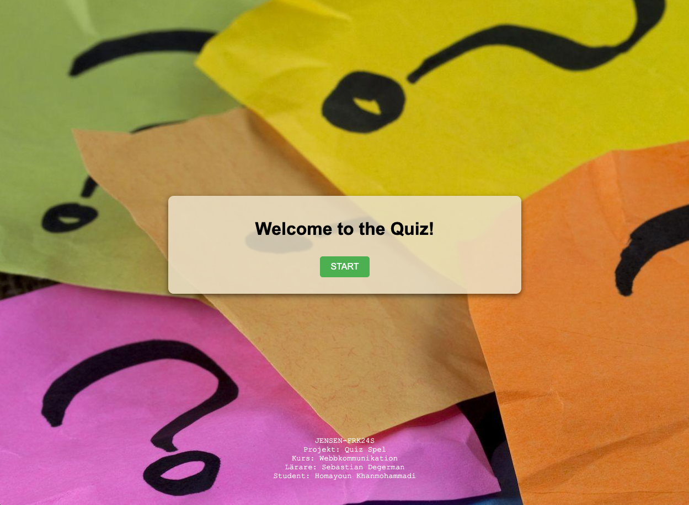
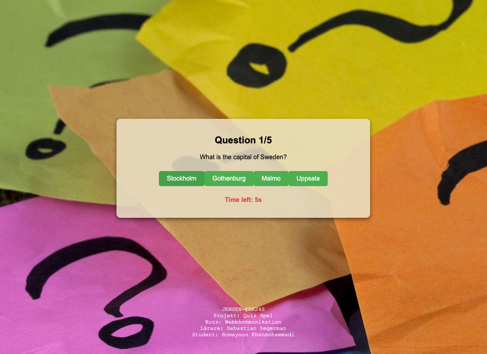
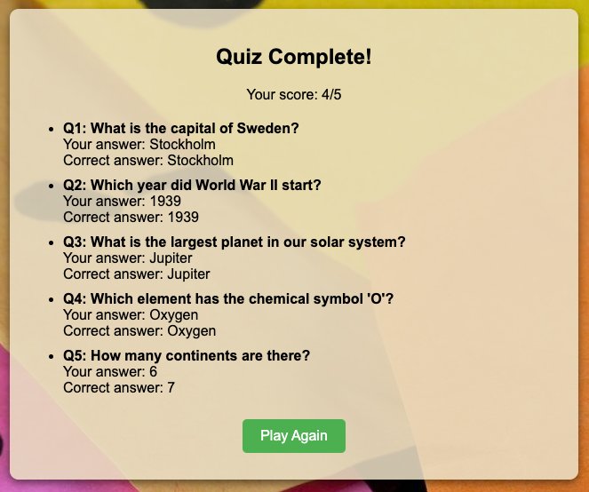

# 🎉 Quiz Game

Welcome to the Quiz Game project! This is a simple interactive quiz built with HTML, CSS, and JavaScript. Test your knowledge and see how many questions you can answer correctly!

---

## 🚀 Live Demo

Check out the live version of the project here:  
[https://homa-x.github.io/Quiz-Game/](https://homa-x.github.io/Quiz-Game/)

---

## 📂 Repository

You can find the full source code on my GitHub:  
[https://github.com/Homa-X/Quiz-Game](https://github.com/Homa-X/Quiz-Game)

---

## 🖼️ Screenshots

Here are some screenshots from the project (non-clickable):

  
  

---

## 📝 How to Play

1. Click **START** to begin the quiz.  
2. Each question has 4 options; click the button of the answer you think is correct.  
3. You have 10 seconds to answer each question before it moves on automatically.  
4. After answering all questions, you will see your total score and a summary of your answers.  
5. Click **Play Again** to restart the quiz.

---

## 💻 Technologies Used

- HTML  
- CSS  
- JavaScript (Vanilla)

---

## 📄 Code Overview

- **app.js:** Contains all JavaScript logic for quiz flow, timing, scoring, and rendering.  
- **index.html:** Basic structure with a root div for rendering the quiz dynamically.  
- **style.css:** Styling for quiz layout, buttons, timer, and results.

---

## 🙋‍♂️ Author

Homayoun Khanmohammadi  
Student at JENSEN-FRK24S  
Project: Quiz Spel  
Course: Webbkommunikation  
Teacher: Sebastian Degerman

---

Thank you for checking out my project! Feel free to fork, star, or suggest improvements. 😊
